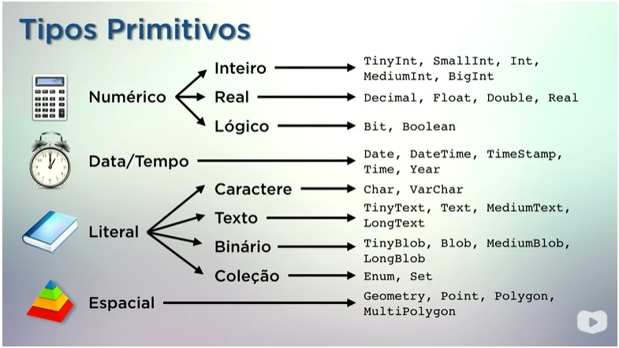

# Curso em video - Banco de dados MySQL

## Tipos de Comando:

### DDL - Data Definition Language: Comandos de definição de dados.
* `Create database`- Criamos um banco de dados.
* `Create Table`- Criamos uma tabela dentro do banco de dados.
* `Alter Table`- Modifica a estrutura de uma tabela existente (ex: adicionar, modificar ou apagar colunas).
    * `CHANGE COLUMN`: Permite **modificar** a definição de uma coluna, incluindo **renomeá-la**. Ao usá-la para renomear, você **deve** re-especificar o tipo de dado e todos os atributos da coluna (como `NOT NULL`, `DEFAULT`, etc.).
        * *Sintaxe:* `ALTER TABLE nome_tabela CHANGE COLUMN nome_antigo nome_novo tipo_de_dados [atributos];`
    * `RENAME COLUMN`: (Disponível a partir do MySQL 8.0) É usado **especificamente** para **renomear** uma coluna. É mais simples que o `CHANGE` para esta tarefa, pois não exige que você repita a definição da coluna.
        * *Sintaxe:* `ALTER TABLE nome_tabela RENAME COLUMN nome_antigo TO nome_novo;`
* `Drop Table`- Apaga os dados de uma tabela e tambem sua estrutura.
* `Truncate Table` - Apaga todos os dados de uma tabela, mas mantém a estrutura da tabela.

#### Conceitos de Relacionamento (Chaves)
* **`Chave Estrangeira (Foreign Key):`** É o campo (ou campos) que estabelece a ligação entre duas tabelas, aplicando o Modelo Relacional.
* Uma Chave Estrangeira em uma tabela (ex: `id_curso` na tabela `alunos`) "aponta" para a Chave Primária (`PRIMARY KEY`) de outra tabela (ex: `id` na tabela `cursos`).
* **Objetivo:** Garante a **Integridade Referencial** do banco de dados. Isso impede, por exemplo, que você cadastre um aluno em um curso que não existe, ou que apague um curso que ainda tenha alunos matriculados (dependendo da configuração).

### DML - Data Manipulation Language: Comandos de manipulação de dados.
* `Insert Into`- Utilizamos para inserir novos registros (Linhas) em uma tabela.
* `Update` - Altera dados de registros (Linhas) **já existentes** em uma tabela.
    *  `Set`- para configurar o novo dado.
    * `Where`- para indicar quais linhas alterar.
* `Delete` - Apaga registros (linhas) de uma tabela.
    * Usa `WHERE` para especificar quais linhas apagar.
    * **Cuidado:** `DELETE` sem `WHERE` apaga **todas as linhas** da tabela!

### DQL - Data Query Language: Comandos de consulta de dados
* `SELECT` - O comando mais importante e mais usado do SQL. Serve para **buscar, ler e exibir** os dados armazenados nas tabelas.
    * `SELECT *` - O asterisco `*` é um coringa que significa "selecione **todas as colunas**".
    * `SELECT coluna1, coluna2` - Seleciona apenas as colunas específicas que você quer ver.

* `FROM` - Usado sempre em conjunto com o `SELECT`, indica de qual **tabela** os dados serão buscados.
    * *Exemplo:* `SELECT nome, carga FROM cursos;` (Mostra apenas as colunas `nome` e `carga` da tabela `cursos`).

* `WHERE` - O **filtro** da sua busca. É usado para especificar condições e retornar apenas as linhas (registros) que atendem a esses critérios.
    * *Exemplo:* `SELECT * FROM cursos WHERE ano = 2016;` (Mostra todos os cursos do ano de 2016).

#### Operadores para usar com o WHERE

* **Operadores de Comparação:**
    * `>` (Maior que)
    * `<` (Menor que)
    * `>=` (Maior ou igual a)
    * `<=` (Menor ou igual a)
    * `=` (Igual a)
    * `!=` ou `<>` (Diferente de)

* **Operadores Lógicos:**
    * `AND` - Usado para **combinar duas ou mais condições**, onde **TODAS** elas devem ser verdadeiras.
    * `OR` - Usado para **combinar duas ou mais condições**, onde **PELO MENOS UMA** delas deve ser verdadeira.

* **Operadores de Intervalo/Lista:**
    * `BETWEEN valor1 AND valor2` - Verifica se um valor está **dentro de um intervalo** (inclusive).
        * *Exemplo:* `WHERE ano BETWEEN 2014 AND 2016;` (É o mesmo que `WHERE ano >= 2014 AND ano <= 2016;`).
    * `IN (valor1, valor2, ...)` - Verifica se um valor **está dentro de uma lista** de opções.
        * *Exemplo:* `WHERE ano IN (2014, 2016, 2018);` (Busca cursos que são *apenas* desses três anos).

* **Operadores de Padrão (Curinga):**
    * `LIKE` - Usado para buscar um padrão específico em uma coluna de texto (String).
    * `NOT LIKE` - Usado para excluir um padrão específico.
    * **Curingas (Wildcards) para usar com `LIKE`:**
        * `%` (Porcentagem) - Representa **zero, um ou vários** caracteres.
            * *Exemplo:* `WHERE nome LIKE 'A%';` (Encontra qualquer nome que **começa** com 'A').
            * *Exemplo:* `WHERE nome LIKE '%a';` (Encontra qualquer nome que **termina** com 'a').
            * *Exemplo:* `WHERE nome LIKE '%SQL%';` (Encontra qualquer nome que **contenha** 'SQL' em qualquer parte).
        * `_` (Underline) - Representa **um único** caractere, e apenas um.
            * *Exemplo:* `WHERE nome LIKE '_aria';` (Encontra 'Maria', 'Daria', etc.).
            * *Exemplo:* `WHERE nome LIKE 'P_p_';` (Encontra 'Papa', 'Pepe', etc.).

* `ORDER BY` - Usado para **ordenar/classificar** os resultados da sua busca. (Vem *depois* do `WHERE`, se ele existir).
    * `ASC` - Ordem **Ascendente** (do menor para o maior, A-Z). É o padrão, não precisa escrever.
    * `DESC` - Ordem **Descendente** (do maior para o menor, Z-A).
    * *Exemplo:* `SELECT * FROM cursos WHERE ano > 2015 ORDER BY nome DESC;` (Mostra cursos pós-2015, ordenados por nome de Z-A).

---

#### Combinando Múltiplas Tabelas (JOINs)
Usamos `JOIN` para consultar dados que estão em mais de uma tabela ao mesmo tempo, baseando-se no relacionamento entre elas (normalmente, a Chave Estrangeira ligando-se à Chave Primária).

* `JOIN` (ou `INNER JOIN`): É o `JOIN` padrão. Retorna **apenas** os registros que têm correspondência (um valor igual) em **ambas** as tabelas. É a interseção.
    * *Sintaxe:* `SELECT T1.colunaA, T2.colunaB FROM tabela1 AS T1 JOIN tabela2 AS T2 ON T1.chave_estrangeira = T2.chave_primaria;`

* `LEFT JOIN` (ou `LEFT OUTER JOIN`): Retorna **TODOS** os registros da tabela da **esquerda** (a `tabela1`, primeira mencionada) e os registros correspondentes da tabela da direita (`tabela2`). Se não houver correspondência na direita, os campos dessa tabela virão como `NULL`.
    * *Exemplo:* Útil para ver "todos os clientes e os pedidos que eles fizeram" (mostra *todos* os clientes, mesmo os que nunca fizeram pedidos).

* `RIGHT JOIN` (ou `RIGHT OUTER JOIN`): É o oposto do `LEFT JOIN`. Retorna **TODOS** os registros da tabela da **direita** (a `tabela2`, segunda mencionada) e os registros correspondentes da esquerda (`tabela1`). Se não houver correspondência na esquerda, os campos dessa tabela virão como `NULL`.
    * *Exemplo:* Útil para ver "todos os produtos e quem os comprou" (mostra *todos* os produtos, mesmo os que nunca foram vendidos).

---
## Tipos Primitivos:

---
## Outros Comandos:
`Desc` ou `describe` serve para vermos as descrições de cada campo.